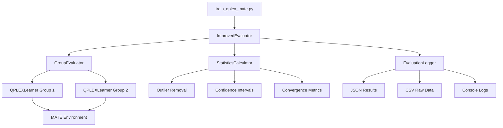
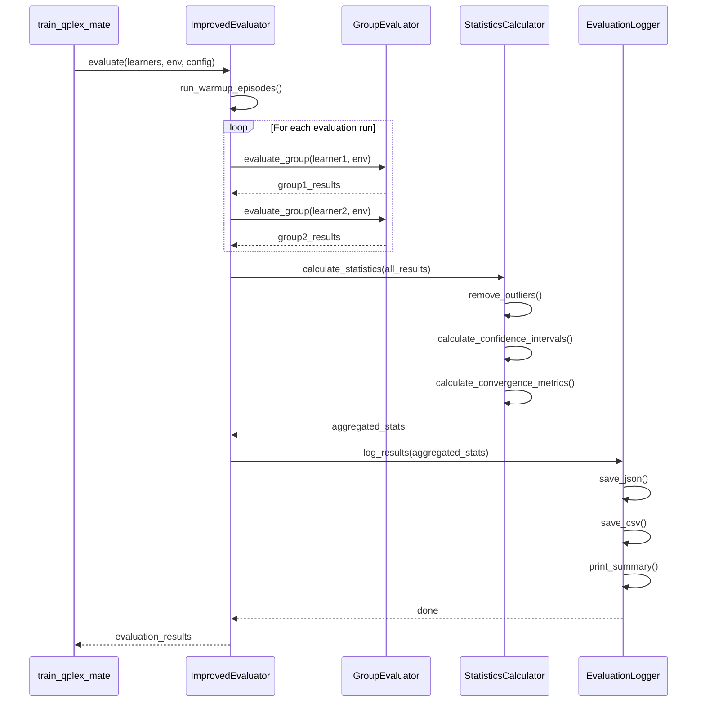

# Design Document

## Overview

Thiết kế hệ thống đánh giá cải tiến cho `train_qplex_mate.py` nhằm giải quyết hai vấn đề chính:
1. Hỗ trợ đánh giá 2 nhóm agent riêng biệt thay vì 1 nhóm
2. Cải thiện độ ổn định và hội tụ của kết quả đánh giá

Giải pháp bao gồm:
- Tạo class `ImprovedEvaluator` để quản lý toàn bộ quá trình đánh giá
- Hỗ trợ multi-group evaluation với metrics riêng biệt
- Áp dụng các kỹ thuật thống kê để giảm variance: warm-up, multiple runs, outlier removal, confidence intervals
- Cấu hình linh hoạt qua YAML config
- Logging và visualization chi tiết

## Architecture

### High-Level Architecture



### Component Interaction Flow



## Components and Interfaces

### 1. ImprovedEvaluator

**Purpose**: Quản lý toàn bộ quá trình đánh giá với multiple groups và multiple runs.

**Interface**:
```python
class ImprovedEvaluator:
    def __init__(self, config: Dict[str, Any]):
        """
        Args:
            config: Evaluation configuration từ YAML
        """
        pass
    
    def evaluate(
        self,
        learners: List[QPLEXLearner],
        env: MultiAgentTracking,
        timestep: int
    ) -> Dict[str, Any]:
        """
        Thực hiện đánh giá đầy đủ với multiple groups và runs.
        
        Args:
            learners: List of 2 QPLEXLearner instances (2 groups)
            env: MATE environment
            timestep: Current training timestep
            
        Returns:
            results: Dictionary chứa tất cả metrics và statistics
        """
        pass
    
    def run_warmup_episodes(
        self,
        learner: QPLEXLearner,
        env: MultiAgentTracking,
        n_episodes: int
    ) -> None:
        """Chạy warm-up episodes để ổn định hidden states."""
        pass
```

**Key Attributes**:
- `config`: Evaluation configuration
- `n_eval_runs`: Số lượng evaluation runs
- `n_episodes_per_run`: Số episodes mỗi run
- `n_warmup_episodes`: Số warm-up episodes
- `batch_size`: Batch size cho evaluation
- `remove_outliers`: Flag để bật/tắt outlier removal
- `confidence_level`: Confidence level cho intervals (default: 0.95)
- `seeds`: List of random seeds cho mỗi run

### 2. GroupEvaluator

**Purpose**: Đánh giá một nhóm agent cụ thể.

**Interface**:
```python
class GroupEvaluator:
    def __init__(self, group_id: int):
        """
        Args:
            group_id: ID của group (0 hoặc 1)
        """
        pass
    
    def evaluate_group(
        self,
        learner: QPLEXLearner,
        env: MultiAgentTracking,
        n_episodes: int,
        seed: int,
        render: bool = False
    ) -> Dict[str, Any]:
        """
        Đánh giá một group agent.
        
        Args:
            learner: QPLEXLearner instance
            env: MATE environment
            n_episodes: Số episodes để đánh giá
            seed: Random seed
            render: Có render không
            
        Returns:
            results: Dictionary chứa raw metrics của group
        """
        pass
    
    def _run_single_episode(
        self,
        learner: QPLEXLearner,
        env: MultiAgentTracking,
        render: bool
    ) -> Dict[str, float]:
        """Chạy một episode và thu thập metrics."""
        pass
```

**Key Attributes**:
- `group_id`: ID của group
- `episode_rewards`: List of episode rewards
- `episode_lengths`: List of episode lengths
- `coverage_rates`: List of coverage rates
- `transport_rates`: List of transport rates

### 3. StatisticsCalculator

**Purpose**: Tính toán các thống kê nâng cao và xử lý outliers.

**Interface**:
```python
class StatisticsCalculator:
    @staticmethod
    def remove_outliers(
        data: np.ndarray,
        method: str = 'iqr',
        threshold: float = 1.5
    ) -> Tuple[np.ndarray, np.ndarray]:
        """
        Loại bỏ outliers sử dụng IQR method.
        
        Args:
            data: Input data array
            method: Method để detect outliers ('iqr' hoặc 'zscore')
            threshold: Threshold cho outlier detection
            
        Returns:
            cleaned_data: Data sau khi loại bỏ outliers
            outlier_mask: Boolean mask của outliers
        """
        pass
    
    @staticmethod
    def calculate_confidence_interval(
        data: np.ndarray,
        confidence: float = 0.95
    ) -> Tuple[float, float, float]:
        """
        Tính confidence interval.
        
        Args:
            data: Input data array
            confidence: Confidence level (0-1)
            
        Returns:
            mean: Mean value
            lower_bound: Lower bound của CI
            upper_bound: Upper bound của CI
        """
        pass
    
    @staticmethod
    def calculate_convergence_metrics(
        data: np.ndarray
    ) -> Dict[str, float]:
        """
        Tính các metrics về convergence.
        
        Args:
            data: Input data array
            
        Returns:
            metrics: Dictionary chứa CV, stability score, etc.
        """
        pass
    
    @staticmethod
    def calculate_summary_statistics(
        data: np.ndarray
    ) -> Dict[str, float]:
        """
        Tính summary statistics (min, max, median, Q1, Q3, etc.).
        
        Args:
            data: Input data array
            
        Returns:
            stats: Dictionary chứa summary statistics
        """
        pass
```

### 4. EvaluationLogger

**Purpose**: Logging và lưu trữ kết quả đánh giá.

**Interface**:
```python
class EvaluationLogger:
    def __init__(self, log_dir: str):
        """
        Args:
            log_dir: Directory để lưu logs
        """
        pass
    
    def log_results(
        self,
        results: Dict[str, Any],
        timestep: int
    ) -> None:
        """
        Log và lưu kết quả đánh giá.
        
        Args:
            results: Evaluation results
            timestep: Current training timestep
        """
        pass
    
    def save_json(
        self,
        results: Dict[str, Any],
        filepath: str
    ) -> None:
        """Lưu results dưới dạng JSON."""
        pass
    
    def save_csv(
        self,
        raw_data: Dict[str, List[float]],
        filepath: str
    ) -> None:
        """Lưu raw data dưới dạng CSV."""
        pass
    
    def print_summary(
        self,
        results: Dict[str, Any]
    ) -> None:
        """In summary ra console."""
        pass
```

## Data Models

### EvaluationConfig

```python
@dataclass
class EvaluationConfig:
    """Configuration cho evaluation."""
    n_eval_runs: int = 5  # Số lượng evaluation runs
    n_episodes_per_run: int = 400  # Số episodes mỗi run (giảm từ 2000)
    n_warmup_episodes: int = 10  # Số warm-up episodes
    batch_size: int = 50  # Batch size cho evaluation
    remove_outliers: bool = True  # Có loại bỏ outliers không
    outlier_method: str = 'iqr'  # Method: 'iqr' hoặc 'zscore'
    outlier_threshold: float = 1.5  # Threshold cho IQR
    confidence_level: float = 0.95  # Confidence level
    seeds: List[int] = None  # Random seeds cho mỗi run
    
    def __post_init__(self):
        if self.seeds is None:
            self.seeds = [42 + i * 100 for i in range(self.n_eval_runs)]
```

### GroupResults

```python
@dataclass
class GroupResults:
    """Results cho một group agent."""
    group_id: int
    run_id: int
    seed: int
    
    # Raw metrics
    episode_rewards: List[float]
    episode_lengths: List[float]
    coverage_rates: List[float]
    transport_rates: List[float]
    
    # Aggregated metrics
    mean_reward: float
    std_reward: float
    mean_length: float
    mean_coverage: float
    mean_transport: float
```

### AggregatedResults

```python
@dataclass
class AggregatedResults:
    """Aggregated results từ multiple runs."""
    group_id: int
    n_runs: int
    n_episodes_total: int
    
    # Statistics với outlier removal
    reward_stats: Dict[str, float]  # mean, std, ci_lower, ci_upper, cv, etc.
    length_stats: Dict[str, float]
    coverage_stats: Dict[str, float]
    transport_stats: Dict[str, float]
    
    # Raw data từ tất cả runs
    all_rewards: List[float]
    all_lengths: List[float]
    all_coverages: List[float]
    all_transports: List[float]
    
    # Outlier information
    n_outliers_removed: int
    outlier_percentage: float
```

### ComparisonResults

```python
@dataclass
class ComparisonResults:
    """So sánh giữa 2 groups."""
    group1_results: AggregatedResults
    group2_results: AggregatedResults
    
    # Comparison metrics
    reward_difference: float  # group1 - group2
    reward_difference_percentage: float
    statistical_significance: bool  # T-test result
    p_value: float
```

## Error Handling

### Exception Classes

```python
class EvaluationError(Exception):
    """Base exception cho evaluation errors."""
    pass

class InsufficientDataError(EvaluationError):
    """Raised khi không đủ data để tính statistics."""
    pass

class ConfigurationError(EvaluationError):
    """Raised khi configuration không hợp lệ."""
    pass
```

### Error Handling Strategy

1. **Validation**: Validate config trước khi bắt đầu evaluation
2. **Graceful Degradation**: Nếu một run fail, tiếp tục với các runs khác
3. **Logging**: Log tất cả errors với stack trace
4. **Fallback**: Nếu outlier removal fail, sử dụng raw data
5. **Retry**: Retry failed episodes với seed khác (max 3 retries)

## Testing Strategy

### Unit Tests

1. **StatisticsCalculator Tests**:
   - Test outlier removal với known data
   - Test confidence interval calculation
   - Test convergence metrics
   - Test edge cases (empty data, single value, etc.)

2. **GroupEvaluator Tests**:
   - Test single episode execution
   - Test metrics collection
   - Test với mock environment

3. **EvaluationLogger Tests**:
   - Test JSON serialization
   - Test CSV writing
   - Test file creation

### Integration Tests

1. **ImprovedEvaluator Tests**:
   - Test full evaluation flow với 2 groups
   - Test warm-up episodes
   - Test multiple runs với different seeds
   - Test với mock learners và environment

2. **End-to-End Tests**:
   - Test integration với train_qplex_mate.py
   - Test với real MATE environment
   - Test checkpoint loading và evaluation

### Performance Tests

1. **Scalability Tests**:
   - Test với large number of episodes (10000+)
   - Test với large number of runs (20+)
   - Measure memory usage

2. **Timing Tests**:
   - Measure evaluation time per episode
   - Compare với old evaluation method

## Configuration Example

```yaml
evaluation:
  # Basic settings
  n_eval_runs: 5  # Số lượng evaluation runs
  n_episodes_per_run: 400  # Giảm từ 2000 xuống 400
  n_warmup_episodes: 10  # Warm-up episodes
  batch_size: 50  # Batch size
  
  # Statistical settings
  remove_outliers: true
  outlier_method: 'iqr'  # 'iqr' hoặc 'zscore'
  outlier_threshold: 1.5  # Cho IQR method
  confidence_level: 0.95  # 95% confidence interval
  
  # Seeds cho reproducibility
  seeds: [42, 142, 242, 342, 442]
  
  # Group settings
  n_groups: 2  # Số lượng groups
  
  # Logging
  save_raw_data: true  # Lưu raw data vào CSV
  save_plots: true  # Tạo plots (optional)
```

## Migration Plan

### Phase 1: Implement Core Components
1. Implement `StatisticsCalculator`
2. Implement `GroupEvaluator`
3. Implement `EvaluationLogger`
4. Implement `ImprovedEvaluator`

### Phase 2: Integration
1. Update `train_qplex_mate.py` để sử dụng `ImprovedEvaluator`
2. Update config files với evaluation settings mới
3. Add backward compatibility với old evaluation method

### Phase 3: Testing & Validation
1. Run unit tests
2. Run integration tests
3. Compare results với old method
4. Validate convergence improvement

### Phase 4: Documentation & Deployment
1. Update README với evaluation instructions
2. Add examples và tutorials
3. Deploy và monitor

## Performance Considerations

### Optimization Strategies

1. **Batch Processing**: Evaluate episodes trong batches để giảm overhead
2. **Parallel Evaluation**: Có thể chạy multiple runs song song (future enhancement)
3. **Memory Management**: Clear buffers sau mỗi run
4. **Caching**: Cache environment states nếu có thể

### Expected Performance

- **Old Method**: 2000 episodes × 1 run = 2000 episodes total
- **New Method**: 400 episodes × 5 runs = 2000 episodes total
- **Benefit**: Giảm variance, tăng confidence, có thể detect outliers

### Trade-offs

- **Pros**: 
  - Kết quả ổn định hơn
  - Confidence intervals
  - Outlier detection
  - Better statistical validity
  
- **Cons**:
  - Slightly more complex code
  - Cần configure thêm parameters
  - Có thể chậm hơn một chút do overhead (nhưng tổng số episodes giống nhau)
